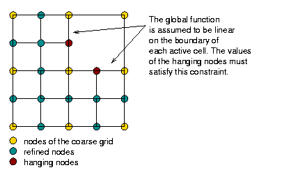
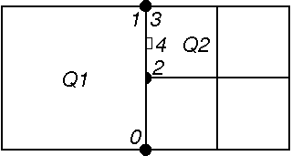
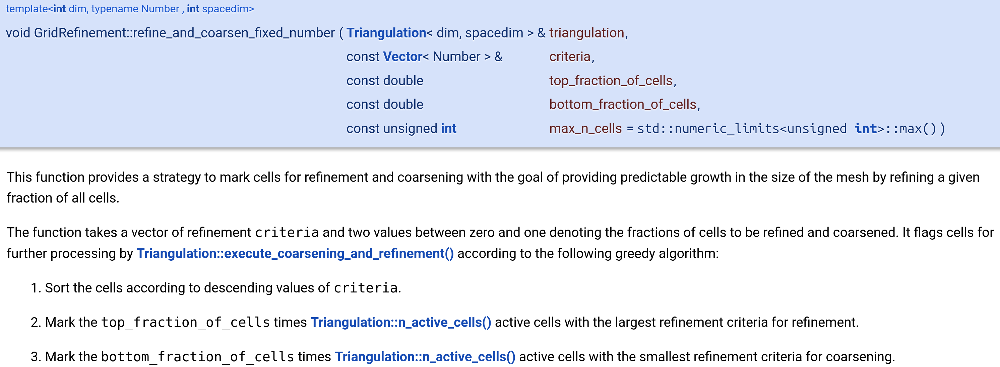

<!--
title: Lab 04
paginate: true

_class: titlepage
-->

# Lab 04
<br>

## Adaptive mesh refinement. Dealing with hanging nodes.<br>deal.II step-6.
<br>

#### Advanced Topic in Scientific Computing - SISSA, UniTS, 2024-2025

###### Pasquale Claudio Africa

###### 18 Oct 2024

---

# Introduction

The tutorial `step-6` deals with solving a Poisson equation with Dirichlet boundary conditions using the Finite Element Method (FEM) on a mesh that includes cells with hanging nodes. Hanging nodes occur when one part of the mesh is more refined than another, and special care must be taken to ensure that the solution is continuous across these nodes.

---

# The Poisson equation solver class

```cpp
template <int dim>
class Step6
{
public:
  Step6();
  void run();

private:
  void setup_system();
  void assemble_system();
  void solve();
  void refine_grid();
  void output_results(const unsigned int cycle) const;

  Triangulation<dim>     triangulation;
  DoFHandler<dim>        dof_handler;
  FESystem<dim>          fe;

  AffineConstraints<double> constraints;

  SparsityPattern           sparsity_pattern;
  SparseMatrix<double>      system_matrix;

  Vector<double>            solution;
  Vector<double>            system_rhs;
};
```

---

# Main function: `run()`

```cpp
template <int dim>
void Step6<dim>::run()
{
  for (unsigned int cycle = 0; cycle < 8; ++cycle)
    {
      std::cout << "Cycle " << cycle << ':' << std::endl;
 
      if (cycle == 0)
        {
          GridGenerator::hyper_ball(triangulation);
          triangulation.refine_global(1);
        }
      else
        refine_grid();
 
 
      std::cout << "   Number of active cells:       "
                << triangulation.n_active_cells() << std::endl;
 
      setup_system();
 
      std::cout << "   Number of degrees of freedom: " << dof_handler.n_dofs()
                << std::endl;
 
      assemble_system();
      solve();
      output_results(cycle);
    }
}
```

---

# Handling hanging nodes

The critical part of the setup for dealing with hanging nodes is the use of the `AffineConstraints` class. This class manages the linear constraints imposed by hanging nodes to ensure that the solution remains continuous.

```cpp
AffineConstraints<double> constraints;
```

The class ensures that the solution on hanging nodes is a linear interpolation of the values at surrounding nodes, maintaining the consistency of the solution. In the setup of the system, we’ll see how `AffineConstraints` are filled with the necessary constraints.

---

# Hanging nodes constraints

<div class="columns">
<div>



</div>
<div>



</div>
</div>

$$
\begin{aligned}
x_2 & = \frac{1}{2}\left(x_0 + x_3\right) \\
x_4 & = \frac{1}{2}\left(x_2 + x_3\right) = \frac{1}{4}x_0 + \frac{3}{4}x_2
\end{aligned}
$$

---

# Refining the grid: the (a-posteriori) Kelly error estimator

```cpp
template <int dim>
void Step6<dim>::refine_grid()
{
  Vector<float> estimated_error_per_cell(triangulation.n_active_cells());
 
  KellyErrorEstimator<dim>::estimate(dof_handler,
                                     QGauss<dim - 1>(fe.degree + 1),
                                     {},
                                     solution,
                                     estimated_error_per_cell);
 
  GridRefinement::refine_and_coarsen_fixed_number(triangulation,
                                                  estimated_error_per_cell,
                                                  0.3,
                                                  0.03);
 
  triangulation.execute_coarsening_and_refinement();
}
```

---

# Refining and coarsening a fixed number of cells



---

# Setting up the system

```cpp
template <int dim>
void Step6<dim>::setup_system()
{
  dof_handler.distribute_dofs(fe);

  constraints.clear();
  DoFTools::make_hanging_node_constraints(dof_handler, constraints);
  constraints.close();

  DynamicSparsityPattern dsp(dof_handler.n_dofs());
  DoFTools::make_sparsity_pattern(dof_handler, dsp, constraints, /* keep_constrained_dofs = */ false);
  sparsity_pattern.copy_from(dsp);

  system_matrix.reinit(sparsity_pattern);

  solution.reinit(dof_handler.n_dofs());
  system_rhs.reinit(dof_handler.n_dofs());
}
```

---

# Setting up the system: key steps
1. **Distribute degrees of freedom**: The `dof_handler.distribute_dofs(fe)` function assigns DoFs to the finite element system.
2. **Handle hanging nodes**: `DoFTools::make_hanging_node_constraints(dof_handler, constraints)` fills the `AffineConstraints` object with the constraints required to ensure the continuity of the solution across hanging nodes.
3. **Sparsity pattern**: The sparsity pattern of the matrix is set up while respecting the constraints on the degrees of freedom, ensuring that hanging node constraints are properly reflected in the system matrix.

---

# Assembling the linear system

```cpp
template <int dim>
void Step6<dim>::assemble_system()
{
  QGauss<dim> quadrature_formula(fe.degree+1);

  FEValues<dim> fe_values(fe, quadrature_formula,
                          update_values | update_gradients |
                          update_quadrature_points | update_JxW_values);

  const unsigned int dofs_per_cell = fe.n_dofs_per_cell();
  FullMatrix<double> cell_matrix(dofs_per_cell, dofs_per_cell);
  Vector<double>     cell_rhs(dofs_per_cell);

  std::vector<types::global_dof_index> local_dof_indices(dofs_per_cell);

  for(const auto &cell : dof_handler.active_cell_iterators())
    {
      fe_values.reinit(cell);
      cell_matrix = 0;
      cell_rhs = 0;

      // Integration over the cell (same as in step-3).

      cell->get_dof_indices(local_dof_indices);
      constraints.distribute_local_to_global(cell_matrix, cell_rhs,
                                             local_dof_indices,
                                             system_matrix, system_rhs);
    }
}
```

---

# Assembling the linear system: key steps

1. **FEValues**: This object handles the computation of values and gradients at the quadrature points for the finite element basis functions.
2. **Constraints application**: The method `constraints.distribute_local_to_global()` ensures that the contributions from cells with hanging nodes are correctly added to the global matrix and right-hand side. This is where the `AffineConstraints` class is crucial, as it modifies the local matrices and vectors to account for the constraints imposed by the hanging nodes.

---

# Solving the linear system

After assembling the system, we solve it using a direct solver.

```cpp
template <int dim>
void Step6<dim>::solve()
{
  SparseDirectUMFPACK  solver;
  solver.solve(system_matrix, solution, system_rhs);

  constraints.distribute(solution);
}
```

## Key steps:
1. **Direct solver**: `SparseDirectUMFPACK` is used to solve the linear system directly.
2. **Applying constraints to solution**: After solving, `constraints.distribute(solution)` ensures that the solution respects the hanging node constraints by modifying the solution vector accordingly.

---

# Output results

Finally, the results are output for visualization.

```cpp
template <int dim>
void Step6<dim>::output_results(const unsigned int cycle) const
{
  DataOut<dim> data_out;

  data_out.attach_dof_handler(dof_handler);
  data_out.add_data_vector(solution, "solution");

  data_out.build_patches();

  std::ofstream output("solution-" + std::to_string(cycle) + ".vtk");
  data_out.write_vtk(output);
}
```

This function outputs the solution in VTK format, which can be visualized using tools like ParaView.

---

# Summary

The key concepts in `step-6.cc` include:
- **Hanging nodes**: These occur when the mesh has irregular refinements. The `AffineConstraints` class is used to ensure that the solution is continuous across these nodes.
- **`AffineConstraints`**: This class handles both hanging nodes and other linear constraints, ensuring that the FEM solution is consistent across the mesh.
- **System assembly**: Constraints are applied during the assembly of the system matrix to ensure that the solution respects the required boundary conditions and continuity requirements.

---

# Assignments

1. Try with a constant diffusion coefficient $a$: what do you expect? What do you observe?
2. Try with different preconditioners and compare the number of linear solver iterations and the computational time.
3. Instead of refining the grid based on the Kelly error estimation, implement a *manual* refinement strategy based on geometric features (e.g., refine near the center of the domain). Compare the results (i.e., number of cells and degrees of freedom) with adaptive refinement.
