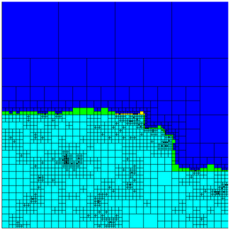
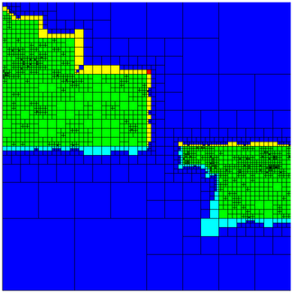
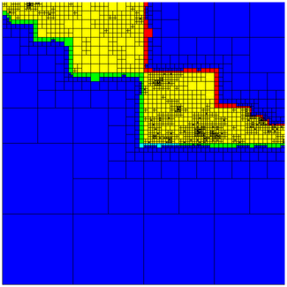
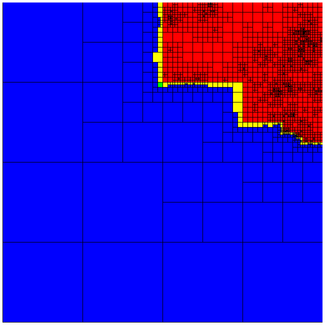

<!--
title: Lab 07
paginate: true

_class: titlepage
-->

# Lab 07
<br>

## DG methods. deal.II step-12.<br>Distributed computing for FEM. deal.II step-40.
<br>

#### Advanced Topic in Scientific Computing - SISSA, UniTS, 2024-2025

###### Pasquale Claudio Africa

###### 07 Nov 2024

---

# Assignment 1

Given that the exact solution is known in the case of `step-12`, your goal is to confirm the order of convergence for this program. In the current case, we can not expect to get a particularly high order of convergence, even if we used higher order elements. As a matter of fact, for hyperbolic equations, theoretical predictions often indicate that the best one can hope for is an order one half below the interpolation estimate. For example, for the streamline diffusion method (an alternative method to the DG method used here to stabilize the solution of the transport equation), one can prove that for elements of degree $p$, the order of convergence is $p+\frac{1}{2}$ on arbitrary meshes.

This should be relatively simple to verify, for example using the `VectorTools::integrate_difference` function.

---

<!--
_class: titlepage
-->

# Distributed computing in deal.II

---

# Introduction to distributed computing in deal.II

Distributed computing in the deal.II library allows researchers and engineers to handle large-scale finite element computations efficiently. This feature enables tasks to be processed across multiple processors or nodes, utilizing both shared and distributed memory models. For problems that require extensive computation and storage, deal.II's distributed computing capabilities are essential, especially when working with large distributed meshes and degrees of freedom that exceed single-machine capacity.

---

# Core libraries and concepts

The distributed computing functionality in deal.II leverages MPI (Message Passing Interface), which is the backbone for distributed memory systems. By using MPI, computations can be distributed across different processors on separate nodes, making it suitable for high-performance computing clusters. Another vital component is the p4est library, which manages dynamically adaptive meshes through a forest-of-trees structure. This adaptive meshing approach is essential for efficient resource utilization, as it allows the library to handle complex, adaptive refinements while simplifying mesh operations across processors. The deal.II library provides interfaces and wrappers that make MPI operations and distributed mesh handling more accessible to users.

---

# Distributed triangulations

Distributed triangulations in deal.II are an essential concept for parallel processing, as they partition a mesh so that each processor owns a unique subset of cells. This partitioning allows each processor to handle its portion of the computation independently, which reduces memory and computational load per processor. Distributed triangulations, managed via classes like `parallel::distributed::Triangulation`, help create a balance between computational efficiency and the practical need to manage large-scale problems. For hybrid memory usage scenarios, `parallel::shared::Triangulation` provides a mix of distributed and shared memory approaches.

---

Rank 0:  Rank 1: 
Rank 2:  Rank 3: 

---

# Load balancing

In distributed computing, load balancing is essential to prevent processors from being idle while waiting for others to complete their tasks. deal.II manages load balancing through adaptive mesh refinement, where areas of the mesh requiring more detailed computation can be refined without overburdening other parts. The p4est library plays a significant role here, dynamically adjusting the mesh to focus resources where they're most needed. Weighting mechanisms allow deal.II to prioritize specific areas in terms of refinement or coarsening, ensuring that workload distribution remains efficient, reducing unnecessary communication costs and processor idle time.

---

# Data structures and ownership

deal.II organizes data in distributed computing by categorizing cells into three types: locally owned cells, ghost cells, and artificial cells. Locally owned cells are those for which each processor has primary responsibility. Ghost cells are additional cells that a processor can read but does not own, allowing for consistent finite element assembly across boundaries. Artificial cells exist as placeholders within each processor's view of the mesh but are neither owned nor shared as ghost cells. This structure ensures that each processor has the necessary data to complete its portion of the computation while reducing the amount of redundant data across the network.

---

# Parallel vectors and matrices

Efficient data storage and operations on distributed memory systems are essential for scalable computations. deal.II uses specialized vectors and matrix classes, such as `TrilinosWrappers::MPI::Vector` and `PETScWrappers::MPI::Vector`, to handle data in parallel. Distributed vectors are optimized for parallel storage, enabling operations like vector assembly and matrix-vector products to be performed efficiently across multiple processors. The use of these classes allows users to perform linear algebra operations necessary for finite element analysis without manually handling the complexities of distributed memory data structures.

---

# Communication patterns

To synchronize data across processors, deal.II employs specific communication patterns, especially around ghost cell values. Ghost exchange operations allow processors to share updates for ghost cells, enabling consistent results when assembling finite element matrices. Non-blocking MPI communications further enhance efficiency by allowing asynchronous data transfers. This approach ensures that while data is exchanged, processors can continue with other computations, minimizing downtime and improving overall performance.

---

# Utility functions and tools

deal.II provides various utilities to assist with distributed computing. Partitioner classes manage the communication and ghosting necessary for parallel vectors, while the `IndexSet` class organizes local and global partitions efficiently. Additionally, mapping tools like `parallel::distributed::MappingQ` facilitate transformations in parallel settings. These tools provide users with both the functionality and flexibility required for complex parallel setups, reducing the complexity of code necessary for distributed systems.

---

<!--
_class: titlepage
-->

# Distributed computing in practice

---

# Transforming a sequential Poisson solver into a distributed one

To transform a sequential FEM solver into a distributed one in deal.II, you need to modify several core functions, including the `setup_system` function. Here follows a concise guide to the key transformations.

# 1. Set up distributed triangulation
Replace the regular `Triangulation` with `parallel::distributed::Triangulation`, which partitions the mesh among processors. Initialize MPI and use `parallel::distributed::Triangulation` to distribute the workload across processors:

```cpp
#include <deal.II/distributed/tria.h>
parallel::distributed::Triangulation<dim> triangulation(MPI_COMM_WORLD);
```

---

# 2. Initialize MPI and update dof handler
Update the `DoFHandler` to work with the distributed triangulation. Initialize MPI at the program start with:

```cpp
Utilities::MPI::MPI_InitFinalize mpi_initialization(argc, argv, 1);
DoFHandler<dim> dof_handler(triangulation);
```

# 3. Use distributed vectors and matrices
Replace sequential vectors and matrices with distributed versions (e.g., PETSc or Trilinos wrappers). These handle data storage across processors:

```cpp
PETScWrappers::MPI::Vector solution, system_rhs;
PETScWrappers::MPI::SparseMatrix system_matrix;
```

---

# 4. Modify `setup_system` for distributed computing
The `setup_system` function initializes DoFs, vectors, and sparsity patterns in a distributed manner. Here's an outline of the function:

```cpp
void setup_system() {
    // Distribute degrees of freedom across processors.
    dof_handler.distribute_dofs(fe);
    locally_owned_dofs = dof_handler.locally_owned_dofs();
    locally_relevant_dofs = dof_handler.locally_relevant_dofs();

    // Initialize distributed vectors and matrices.
    solution.reinit(locally_owned_dofs, locally_relevant_dofs, mpi_communicator);
    system_rhs.reinit(locally_owned_dofs, mpi_communicator);

    // Set up distributed sparsity pattern.
    DoFTools::make_sparsity_pattern(dof_handler, dsp, constraints, false);
    SparsityTools::distribute_sparsity_pattern(dsp, dof_handler.locally_owned_dofs(),
                                               mpi_communicator, locally_relevant_dofs);
    system_matrix.reinit(locally_owned_dofs, locally_owned_dofs, dsp, mpi_communicator);
}
```

---

# 5. Assembly and solver adjustments
During assembly, restrict operations to locally owned cells:

```cpp
for (const auto &cell : dof_handler.active_cell_iterators())
    if (cell->is_locally_owned())
      {
          // Assembly for locally owned cells.
      }

system_matrix.compress(VectorOperation::add);
system_rhs.compress(VectorOperation::add);
```

Use a distributed linear solver (e.g., PETSc) and synchronize ghost cells after solving:

```cpp
PETScWrappers::SolverCG solver(solver_control, mpi_communicator);
solver.solve(system_matrix, solution_owned, system_rhs, preconditioner);
solution = solution_owned;
```

---

# 6. Output results
Output the solution in parallel using `DataOut` for VTK, PVD, or HDF5 formats:

```cpp
DataOut<dim> data_out;
data_out.attach_dof_handler(dof_handler);
data_out.add_data_vector(solution, "solution");
data_out.build_patches();
data_out.write_vtu_with_pvtu_record("./output", "solution", timestep, mpi_communicator);
```

These changes transform a sequential Poisson solver into a distributed one, enabling it to leverage multiple processors for efficient parallel computation.

---

# Assignment 2

- Given the techniques just described, parallelize `step-12` using distributed computing.
- (**Bonus**) Run `step-40` in 3D and evaluate the computational burden when running sequentially vs. in parallel.
- (**Bonus**) Compare the performance gain attainable using distributed computing vs. the one provided by implementing mutithreading techniques (e.g. assignment 2 from Lab06).
